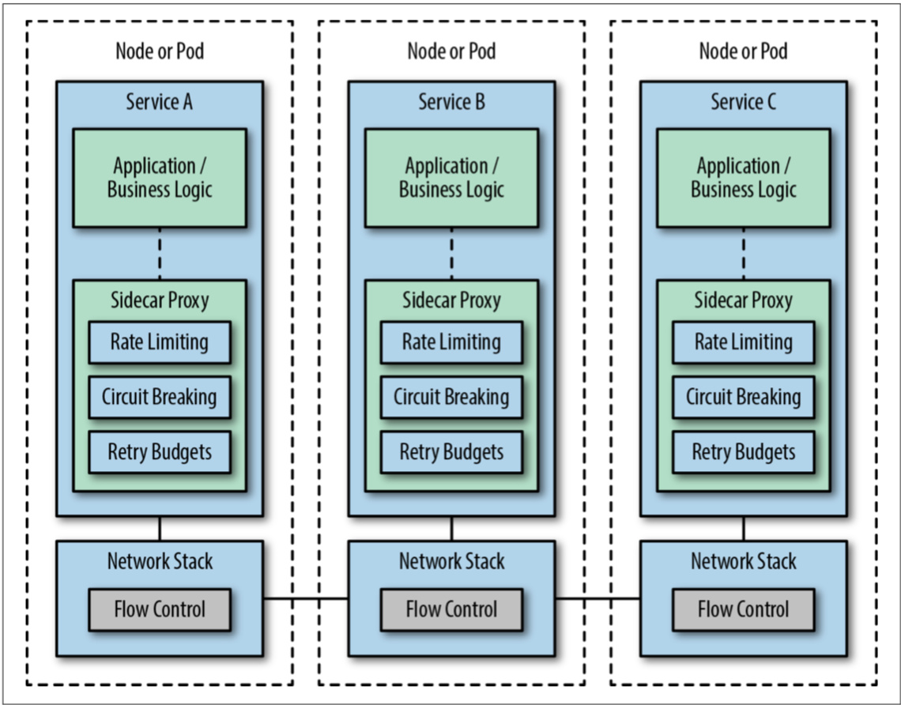
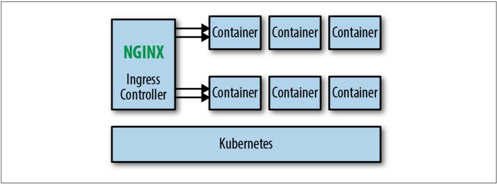
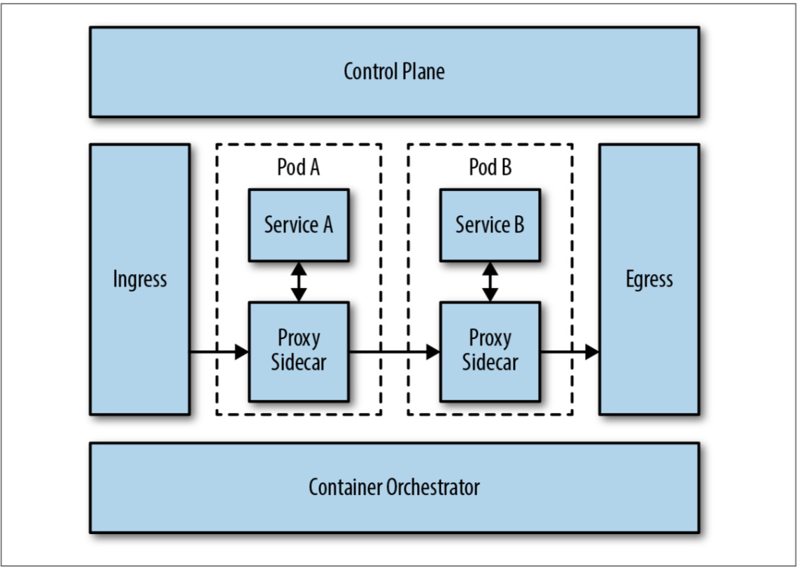

---
owners:
  - rootsongjc
reviewers:
  - haiker2011
  - tangyong
description: 本文介绍了服务网格架构中的实现模式。
publishDate: '2019-03-10T00:00:00.000Z'
updateDate: '2019-03-15T00:00:00.000Z'
tags:
  - service mesh
category: evolution
---

# 服务网格的实现模式

我们在前面看到了通过**客户端库**来治理服务的架构图，那是我们在改造成 Service Mesh 架构前使用微服务架构通常的形式，下图是使用 Service Mesh 架构的最终形式。

当然在达到这一最终形态之前我们需要将架构一步步演进，下面给出的是参考的演进路线。

## Ingress 或边缘代理

如果你使用的是 Kubernetes 做容器编排调度，那么在进化到 Service Mesh 架构之前，通常会使用 Ingress Controller，做集群内外流量的反向代理，如使用 Traefik 或 Nginx Ingress Controller。

这样只要利用 Kubernetes 的原有能力，当你的应用微服务化并容器化需要开放外部访问且只需要 L7 代理的话这种改造十分简单，但问题是无法管理服务间流量。

## 路由器网格

Ingress 或者边缘代理可以处理进出集群的流量，为了应对集群内的服务间流量管理，我们可以在集群内加一个 `Router` 层，即路由器层，让集群内所有服务间的流量都通过该路由器。

这个架构无需对原有的单体应用和新的微服务应用做什么改造，可以很轻易的迁移进来，但是当服务多了管理起来就很麻烦。

## Proxy per Node

这种架构是在每个节点上都部署一个代理，如果使用 Kubernetes 来部署的话就是使用 `DaemonSet` 对象，Linkerd 第一代就是使用这种方式部署的，一代的 Linkerd 使用 Scala 开发，基于 JVM 比较消耗资源，二代的 Linkerd 使用 Go 开发。

这种架构有个好处是每个节点只需要部署一个代理即可，比起在每个应用中都注入一个 sidecar 的方式更节省资源，而且更适合基于物理机/虚拟机的大型单体应用，但是也有一些副作用，比如粒度还是不够细，如果一个节点出问题，该节点上的所有服务就都会无法访问，对于服务来说不是完全透明的。

## Sidecar 代理/Fabric 模型

这个一般不会成为典型部署类型，当企业的服务网格架构演进到这一步时通常只会持续很短时间，然后就会增加控制平面。跟前几个阶段最大的不同就是，应用程序和代理被放在了同一个部署单元里，可以对应用程序的流量做更细粒度的控制。

这已经是最接近 Service Mesh 架构的一种形态了，唯一缺的就是控制平面了。所有的 sidecar 都支持热加载，配置的变更可以很容易的在流量控制中反映出来，但是如何操作这么多 sidecar 就需要一个统一的控制平面了。

## Sidecar 代理/控制平面

下面的示意图是目前大多数 Service Mesh 的架构图，也可以说是整个 Service Mesh 架构演进的最终形态。

这种架构将代理作为整个服务网格中的一部分，使用 Kubernetes 部署的话，可以通过以 sidecar 的形式注入，减轻了部署的负担，可以对每个服务做细粒度权限与流量控制。但有一点不好就是为每个服务都注入一个代理会占用很多资源，因此要想方设法降低每个代理的资源消耗。

## 多集群部署和扩展

以上都是单个服务网格集群的架构，所有的服务都位于同一个集群中，服务网格管理进出集群和集群内部的流量，当我们需要管理多个集群或者是引入外部的服务时就需要[网格扩展](https://preliminary.istio.io/zh/docs/setup/kubernetes/additional-setup/mesh-expansion/)和[多集群配置](https://istio.io/docs/setup/kubernetes/multicluster-install/)。

## 参考

* [企业级服务网格架构之路解读](https://jimmysong.io/posts/the-enterprise-path-to-service-mesh-architectures/)

